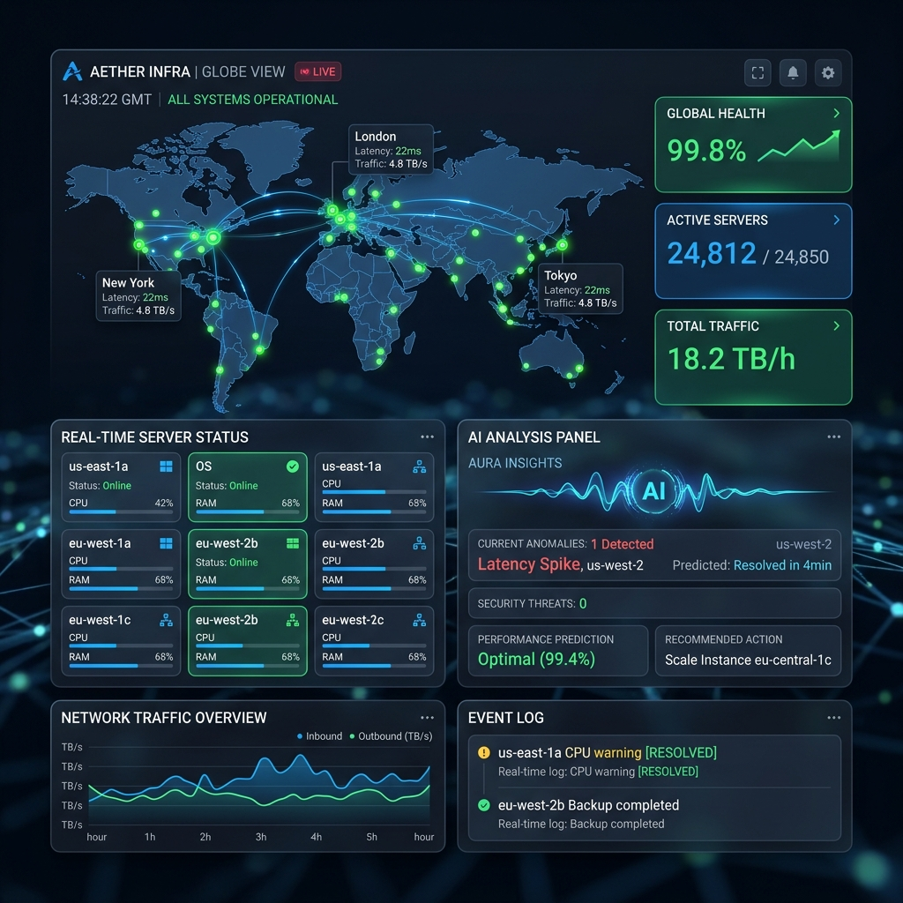
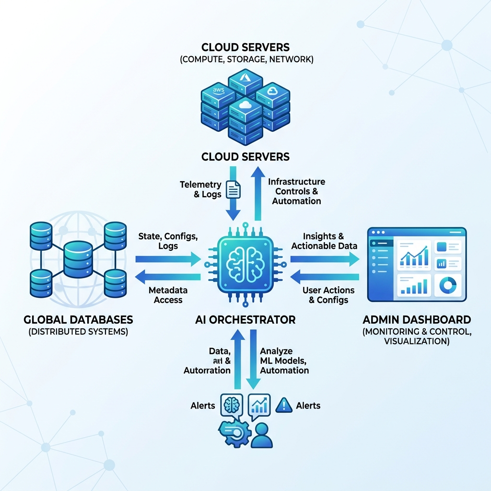

# 🚀 DN Solutions | InfraOps Copilot (Demo)

[](https://github.com/glory903-devsecops/dn-ax-infraops/actions/workflows/deploy.yml)

> **"지능형 런북 기반의 글로벌 인프라 장애 대응 자동화 플랫폼"**  
> **[👉 실시간 데모 사이트 바로가기](https://glory903-devsecops.github.io/dn-ax-infraops/)**

본 프로젝트는 **DN 솔루션즈**의 글로벌 인프라 운영 효율성을 극대화하기 위해 설계된 AI 기반의 Intelligent Monitoring & Operations PoC입니다.

---

## 📈 핵심 가치 (Core Values)

1.  **AI 기반 장애 원인 분석**: 수천 페이지의 물리적 런북(Runbook)을 AI가 실시간으로 학습하여 대응 매뉴얼을 즉시 제시합니다.
2.  **표준화된 운영 (ITIL/SRE)**: 글로벌 표준(ITIL, Cisco, SRE)에 기반한 데이터 중심의 인프라 운영 체계를 제안합니다.
3.  **GitHub Actions 자동 배포**: CI/CD 파이프라인을 통한 정적 데모 사이트 배포로 실시간 가시성을 확보합니다.

## 📡 인프라 시나리오 (DN Solutions Focus)

-   **DN-HQ-Core-Backbone**: 서울 본사 L3 코어 인프라 (Nexus 9K)
-   **DN-Factory-CW-Line1**: 창원 공장 MES 연동 생산 라인 게이트웨이
-   **DN-Global-Sales-EU**: 유럽 법인(Germany) 거점 VPN 라우터
-   **DN-Cloud-Bridge-AWS**: 하이브리드 클라우드 전용 회선(Direct Connect)

---

## 🖥️ 대시보드 미리보기 (Premium UI)


*AI 기반 실시간 네트워크 상태 모니터링 및 자동 분석 화면*

---

## 🛠️ 시스템 아키텍처


*Intelligent Runbook Analysis & Multi-Region Infra Orchestration*

---

## 🛠️ 주요 기술 스택

- **Core**: Python 3.10+ / Django 4.2
- **AI Engine**: OpenAI GPT-4o Integration (Intelligent Runbook Parsing)
- **Database**: PostgreSQL (Operational Data Store)
- **Frontend**: Vanilla CSS Premium Dashboard (Glassmorphism & Micro-animations)
- **Deployment**: Docker Compose / GitHub Actions (CI/CD)

---

## 🚀 빠른 시작 (Quick Start)

본 프로젝트는 Docker를 활용한 간편 실행 또는 로컬 Python 환경에서의 직접 실행을 모두 지원합니다.

### Option 1. Docker 환경에서 실행 (권장)
가장 빠르고 표준화된 실행 방법입니다.

```bash
# 1. 프로젝트 복제 및 이동
git clone https://github.com/glory903-devsecops/dn-ax-infraops.git
cd dn-ax-infraops

# 2. 컨테이너 빌드 및 실행
docker-compose up --build -d

# 3. 실전형 데모 데이터 주입 (1,000개 이상의 자산 시뮬레이션)
docker-compose exec web python scripts/populate_dn_demo.py

# 4. 접속: http://localhost:8000
```

### Option 2. 로컬 Python 환경에서 실행
개발 및 디버깅에 적합한 수동 설치 방법입니다.

```bash
# 1. 가상환경 생성 및 활성화
python -m venv venv
source venv/bin/activate  # Windows: venv\Scripts\activate

# 2. 의존성 라이브러리 설치
pip install -r requirements.txt

# 3. 환경 변수 설정 (.env 파일 생성)
echo "DEBUG=True" > .env
echo "SECRET_KEY=dev-secret-key" >> .env

# 4. 데이터베이스 마이그레이션 및 데이터 주입
python manage.py migrate
python scripts/populate_dn_demo.py

# 5. 개발 서버 실행
python manage.py runserver

# 6. 접속: http://localhost:8000
```

---

## 📈 프로젝트 목표 및 가치

1.  **AI 지능형 장애 대응**: 비정형 런북 데이터를 정형화하여 AI가 즉각적인 조치 가이드를 제시합니다.
2.  **글로벌 가시성**: 세계 각국에 흩어진 DN 솔루션즈의 인프라를 한눈에 모니터링합니다.
3.  **운영 자동화**: 단순 반복적인 장애 처리 프로세스를 자동 복구 시퀀스로 대체하여 MTTR(평균 복구 시간)을 혁신적으로 단축합니다.

---
*Created by **DN Solutions Infra Operations Team** - Intelligent Infrastructure Management Platform Portfolio*
